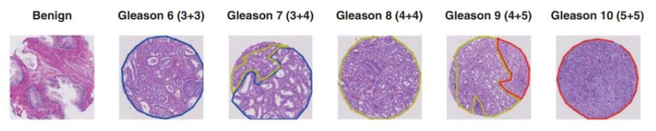

# Automated Gleason Grading of Whole Slide Images

This repository contains the work done as a part of the R&D Course at [**Me**dical **D**eep Learning and **A**I **L**ab](https://www.ee.iitb.ac.in/web/research/labs/medal{:target="_blank"} at EE Department, IIT Bombay. I have done this project in collaboration with [Parth Dodhia](https://pdudeia.github.io/) and [Gautam Kumar](https://www.linkedin.com/in/gautam-kumar-705b28217/?originalSubdomain=in) under the guidance of [Prof. Amit Sethi](https://www.ee.iitb.ac.in/~asethi/). You can find the [report](./RND_report.pdf) and [presentation](./presentation.pdf) respectively.  

---
## Abstract
Prostrate Cancer is the second leading cause of cancer deaths in men[1]. The
Gleason Grading Systems was developed to find the severity of cancer and grade
them accordingly based on some specific heterogeneous pattern. This Gleason
Grading requires highly trained pathologist. We have designed a automated Annotation system using Deep Learning, where given a WSI(Whole Slide Image)
of a Patient, the model predict the type of Gleason Grade. We have trained our
system on 641 patients and then evaluated on an independent set of 245 patients.
Availability of annotated ground truths enabled us to implement a segmentation
model. We also experimented with attention based MIL models on the patch level.
We also did not expect a very clear boundary between two different grades of cancer in the same histopathology image, and we were able to predict majority class,
that is the type of Gleason Grade reasonably well. Finally, we found that the
model performed well in discriminating between Gleason grade 3 and 4.
## Overview
Prostatic Carcinomas are graded according to the Gleason scoring system which
was first established by Donald Gleason in 1966[2]. The Gleason Grading System
is acknowledged by the World Health Organization(WHO) and has been modified and revised in 2005 and 2014 by the International Society of Urological
Pathology(ISUP)[3].. Though there was several changes in the clinical diagnosis
methods, Gleason grading remains as one of powerful prognostic tool.The diagnosis using Gleason Grading is based on pattern of tumours. The histological
patterns are given different grades between 1 to 5, 1 indicating well differentiated
and 5 indicating poorly differentiated. Gleason pattern 4 includes fused glands,
cribriform and glomeruloid structures and poorly formed glands. Gleason pattern 5 involves poorly differentiated individual cells, sheets of tumour, solid nests,
cords and linear arrays as well as comedonecrosis. Gleason Grade-3 and Gleason
Grade-4 are usually present in pairs, and in order avoid diagnosis error and provide correct treatment an automated solution would be extremely useful. In this
report, we present an approach using a UNet Model to classify different Gleason
Grades of Prostrate Cancer. We have used our evaluation metric as Cohen’s Kappa
since the test set images were labelled by two pathologists and it also has a class
imbalance problem. We also experimented with the recent technique of attention
based multiple instance learning.
## Conclusion
The segmentation approach gave reasonable results with good performance on the
test as compared to agreement between pathologists. It did quite well in discriminating between Gleason grades 3 and 4 which is an important factor for diagnosis.
Future work could be to feed a multi-resolution input to the UNet for better performance.

Attention based classification was not working for all the classes. The model is
easily able to identify Gleason 3 and Gleason 4. The training process was very
unstable. We tried various schedulers and increased the depth of the attention and
classification layers, but we couldn’t get good results. The model was overfitting
the train set with train accuracies reaching more than 80%.
Further work can be to use segmentation with self guided attention as mentioned
in the given paper.
